  

  
  
  

## Engineering software people can trust

I am a software and AI engineer focused on **developer infrastructure, application security, AI systems, and automation**.

My work turns complex operations into explicit, testable, and auditable systems. I care about what happens outside the happy path: deterministic behavior, honest failure modes, secure boundaries, and evidence that can be independently verified.

<table>
  <tr>
    <td width="33%" valign="top">
      <strong>Trustworthy systems</strong> 
      Evidence, policy, reproducibility, and explainable decisions built into the product.
    </td>
    <td width="33%" valign="top">
      <strong>Developer infrastructure</strong> 
      Compilers, control planes, CLIs, APIs, CI/CD, and tools that improve engineering workflows.
    </td>
    <td width="33%" valign="top">
      <strong>Secure automation</strong> 
      Guardrails that preserve human oversight without hiding risk or operational complexity.
    </td>
  </tr>
</table>

## Selected open-source work

<table>
  <tr>
    <td width="50%" valign="top">
      <h3><a href="https://github.com/TheAlphaEngineerCode/proofforge">ProofForge</a></h3>
      
<strong>Autonomous engineering with verifiable changes.</strong>

      
Runs repository checks in isolation, collects security and dependency evidence, evaluates policy, and emits a hashable proof manifest for every change.

      
<code>TypeScript</code> <code>Python</code> <code>PostgreSQL</code> <code>Security</code>

    </td>
    <td width="50%" valign="top">
      <h3><a href="https://github.com/TheAlphaEngineerCode/accessforge">AccessForge</a></h3>
      
<strong>Accessibility engineering beyond one-off audits.</strong>

      
Analyzes real user journeys, turns accessibility findings into reproducible evidence, and helps teams prevent regressions continuously.

      
<code>Accessibility</code> <code>Journey testing</code> <code>Automation</code>

    </td>
  </tr>
  <tr>
    <td width="50%" valign="top">
      <h3><a href="https://github.com/TheAlphaEngineerCode/alpha-graph-code">Alpha Graph Code</a></h3>
      
<strong>A compiler for deterministic AI workflows.</strong>

      
Uses a normative intermediate representation to validate, simulate, and compile portable AI workflows without hiding execution semantics.

      
<code>TypeScript</code> <code>Compilers</code> <code>AI workflows</code> <code>Local-first</code>

    </td>
    <td width="50%" valign="top">
      <h3><a href="https://github.com/TheAlphaEngineerCode/the-alpha-cloud">The Alpha Cloud</a></h3>
      
<strong>An open-source infrastructure control plane.</strong>

      
Unifies cloud, containers, Kubernetes, and on-prem operations around inventory, approvals, observability, automation, and cost awareness.

      
<code>TypeScript</code> <code>Cloud</code> <code>Control plane</code> <code>DevOps</code>

    </td>
  </tr>
</table>

## How I build

- **Evidence over confidence.** A passing claim should point to a check, test, trace, or reproducible artifact.
- **Determinism by design.** Inputs, decisions, and outputs should remain inspectable and repeatable.
- **Security at the boundary.** Secrets, untrusted execution, tenant isolation, and destructive actions need explicit controls.
- **Honest scope.** Planned controls are labeled as planned; simulations are labeled as simulations; limitations stay visible.
- **Open and replaceable.** Prefer open standards, portable interfaces, and providers that can be changed without rewriting the system.

## Toolbox

  
  
  
  
  
  
  

---

  <strong>Build deliberately. Verify independently.</strong> 
  Open to conversations about developer tools, secure automation, and trustworthy AI systems.

